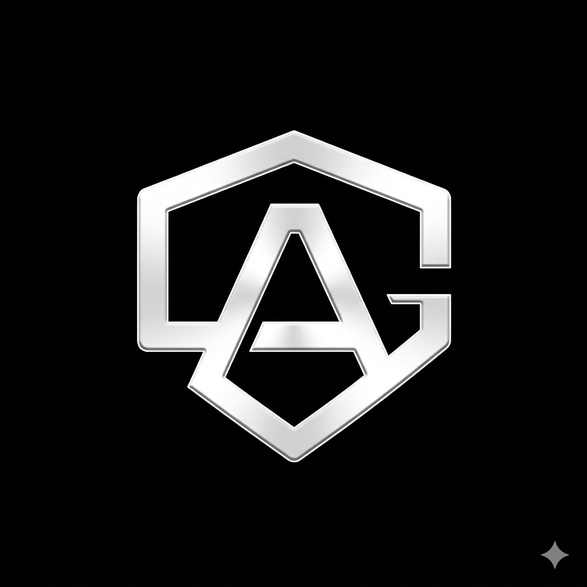

<p align="center">
  
</p>

<h1 align="center">AllowanceGuard</h1>

<p align="center">
  <strong>Open-source Web3 wallet security.</strong><br>
  Scan any wallet for active token approvals across 27 EVM chains, score each approval's risk, and revoke dangerous ones in a single signed transaction.
</p>

<p align="center">

[](LICENSE)
[](https://nextjs.org/)
[](https://www.typescriptlang.org/)
[](https://react.dev/)
[](SECURITY.md)

</p>

<p align="center">
  <a href="https://www.allowanceguard.com">Live</a> •
  <a href="https://www.allowanceguard.com/docs">Docs</a> •
  <a href="https://www.allowanceguard.com/docs/api-reference">API</a> •
  <a href="https://www.allowanceguard.com/pricing">Pricing</a>
</p>

---

## What AllowanceGuard does — and doesn't

**Does.** Reads the approval state of any EVM wallet you point it at. Surfaces unlimited approvals, approvals to unknown spenders, and approvals to contracts associated with known exploits. Lets the wallet owner revoke any or all in a single signed transaction where the chain supports batching (EIP-5792), or sequentially elsewhere. A separate browser extension shows the same signals before you sign an approval in a dApp.

**Does not.** Block transactions, audit smart contracts, guarantee any spender is safe, detect every form of wallet compromise, or replace the confirmation screen in your wallet. Warnings are advisory. Your wallet remains in control.

Non-custodial by design: we never ask for private keys or seed phrases. Scanning reads public chain data. Revocations are signed in your wallet, by you.

## Use it

| Path | What you get | Where |
|------|--------------|-------|
| **Web app** | Scan, score, revoke — free, no account for up to three wallets | [allowanceguard.com/#scan](https://www.allowanceguard.com/#scan) |
| **Browser extension** | Pre-transaction review of `approve` / `permit` / `setApprovalForAll` in any dApp | Chrome Web Store / Firefox Add-ons |
| **REST API** | Programmatic scan + risk scoring for your own product | [API reference](https://www.allowanceguard.com/docs/api-reference) |
| **Node SDK** | `@allowance-guard/client` — framework-agnostic TypeScript client | [`packages/client`](packages/client) |
| **React hooks** | `@allowance-guard/react` — hooks built on the SDK | [`packages/react`](packages/react) |

## Plans

Free: the core scanner. Three wallets. All 27 chains. Always open source.

Paid (Pro / Sentinel / API Developer / API Growth / API Enterprise): continuous monitoring, batch revoke, audit exports, team dashboards, higher API limits. Priced in USD, billed via Stripe. See [pricing](https://www.allowanceguard.com/pricing).

## Supported chains

27 EVM networks as of this revision: Ethereum, Arbitrum, Base, Optimism, Polygon, Avalanche, BNB Smart Chain, Fantom, zkSync Era, Polygon zkEVM, Mantle, Gnosis, Linea, Scroll, Celo, Blast, Cronos, Moonbeam, Aurora, opBNB, Manta, Mode, Taiko, Metis, Kava, ZetaChain, Worldchain.

Authoritative list: [`src/lib/networks.ts`](src/lib/networks.ts). Add-a-chain runbook: [`memory/product-engineering/chain-support.md`](memory/product-engineering/chain-support.md).

## Quickstart (local dev)

```bash
pnpm install
cp .env.example .env.local    # fill in DATABASE_URL + NEXT_PUBLIC_APP_URL at minimum
pnpm dev                      # http://localhost:3000
```

Full dev guide: [`docs/operator/DEPLOYMENT.md`](docs/operator/DEPLOYMENT.md).

## Repository map

```
src/app/                    Next.js 15 App Router — pages, API routes, middleware
src/components/             UI components (Ledger design system)
src/lib/                    shared libs — db, auth, billing, risk, chains
migrations/                 numbered SQL migrations (001..NNN_<slug>.sql)
extension/                  browser extension (MV3, Chrome + Firefox)
packages/client/            @allowance-guard/client — TypeScript SDK
packages/react/             @allowance-guard/react — React hooks on the SDK
docs/operator/              ops runbooks (deploy, cron, webhooks, monitoring)
docs/legal/                 internal legal references
docs/archive/               superseded plans and historical docs
memory/                     project memory loaded by Claude-agent workflows
projects/allowanceguard/    product truth — ARCHITECTURE, BUSINESS, DESIGN, STATUS
scripts/                    migrations runner, image generator, smoke tests, publish
```

## Tech stack

Next.js 15 (App Router) · TypeScript 5 · React 19 · PostgreSQL via Neon serverless HTTP · Upstash Redis (rate limit + metrics) · Stripe (subscriptions) · wagmi + Reown AppKit (wallet) · viem (chain calls) · Jest (unit) · Playwright (e2e).

Observability: Rollbar for errors, structured JSON logs, `/api/healthz` for uptime probes.

## Security

Report vulnerabilities privately to `security@allowanceguard.com`. Full policy in [`SECURITY.md`](SECURITY.md).

Production hardening highlights (see `SECURITY.md` for the full list):

- No keys, seeds, or PII ever touch our systems — scanning reads public chain data only.
- Sessions are opaque, rotating, HTTP-only cookies; CSRF on every state-changing consumer request.
- Per-endpoint rate limiting (Upstash); fail-open on provider outages so a Redis hiccup cannot take payment flows down.
- Webhook signatures verified on every Stripe callback; no unsigned payload path.
- Strict CSP, X-Frame-Options DENY, HSTS preload.

## Contributing

Code contributions welcome. Before you open a PR:

1. Read [`CONTRIBUTING.md`](CONTRIBUTING.md).
2. Agree to the [`CLA.md`](CLA.md) (the PR template prompts you). Organisations: [`CORPORATE_ADDENDUM.md`](CORPORATE_ADDENDUM.md).
3. Write tests. `pnpm test` must stay green; `pnpm exec tsc --noEmit` must be zero errors.
4. Keep claims about the product [calibrated and sourced](memory/compliance-risk/claims-register.md). No absolute-security language.

Non-trivial changes are reviewed through the Standing Council defined in [`CLAUDE.md`](CLAUDE.md) — editorial, security, legal, accessibility, performance, investor voice, and more. Reference the members whose vetos apply.

Code of Conduct: [`CODE_OF_CONDUCT.md`](CODE_OF_CONDUCT.md).

## License

Dual-licensed. See [`LICENSE_STRATEGY.md`](LICENSE_STRATEGY.md) for the rationale.

- **AGPL-3.0-or-later** for open-source use. If you run a modified version as a service, you must publish the source under the same license.
- **Commercial license** for closed-source / SaaS use without the AGPL obligation. Contact `legal@allowanceguard.com`.

All files carry [`LICENSE_HEADER.txt`](docs/legal/LICENSE_HEADER.txt) where applicable.

## Acknowledgments

Built on Ethereum, Next.js, Vercel, Neon, Upstash, Stripe, Reown, wagmi, viem, Tailwind, lucide-react, and a lot of coffee.

## Contact

- General: `hello@allowanceguard.com`
- Security: `security@allowanceguard.com`
- Legal: `legal@allowanceguard.com`
- Sales / Enterprise: `sales@allowanceguard.com`
- Issues & feature requests: [github.com/EazyAccessEA/Allowance-guard/issues](https://github.com/EazyAccessEA/Allowance-guard/issues)

---

<p align="center">
  <sub>Open source core · AGPL-3.0 · Independently operated · Built to last</sub>
</p>
